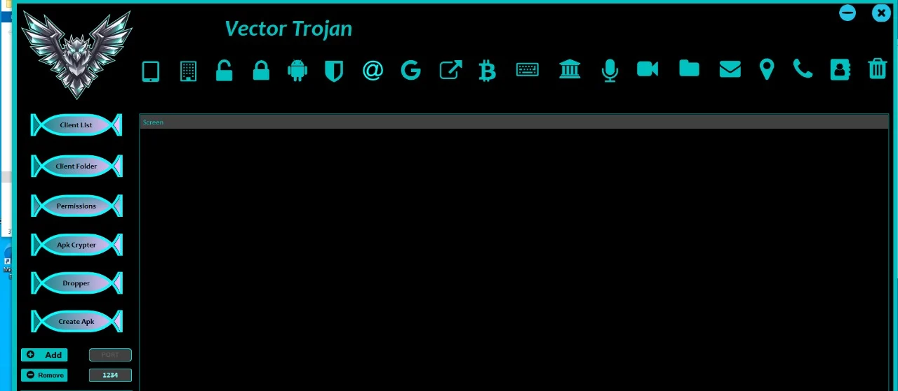

 Vector-Rat

Vector-Rat is a powerful, efficient, and flexible remote access tool designed to provide an easy-to-use platform for managing and controlling remote devices. Built with scalability and performance in mind, it supports various functionalities for remote control, file management, and system monitoring.



## Features

- **Remote Access**: Gain control of remote machines with ease.
- **File Management**: Transfer files to and from remote machines.
- **System Monitoring**: Track system resources, running processes, and more.
- **Real-Time Interaction**: Execute commands and interact with the remote system in real time.
- **Cross-Platform**: Compatible with various platforms, including Windows, macOS, and Linux.
- **Encryption**: Secure communication between client and server using encryption protocols.

## Installation

### Prerequisites

- **Python 3.x**: Ensure Python is installed on your system.
- **Git**: Install Git to clone the repository.

### Steps

1. Clone the repository:
    ```bash
    git clone https://github.com/Vector-OS/Vector-Rat.git
    ```

2. Navigate to the project directory:
    ```bash
    cd Vector-Rat
    ```

3. Install the required dependencies:
    ```bash
    pip install -r requirements.txt
    ```

## Usage

### Starting the Server

To start the server, run the following command:

```bash
python server.py
```

The server will now be running and waiting for incoming connections from clients.

### Starting the Client

To start the client, run the following command:

```bash
python client.py
```

Make sure the client connects to the correct server IP address and port.

## Configuration

You can configure various settings in the `config.py` file, such as:

- **Server IP**: The IP address where the server will run.
- **Port**: The port for the server-client connection.
- **Encryption**: Enable or disable encryption for communication.

## Contributing

We welcome contributions! If you'd like to contribute, please follow these steps:

1. Fork the repository.
2. Create a new branch:
    ```bash
    git checkout -b feature-branch
    ```
3. Commit your changes:
    ```bash
    git commit -am 'Add new feature'
    ```
4. Push to your branch:
    ```bash
    git push origin feature-branch
    ```
5. Create a new Pull Request.

Please ensure your contributions follow the project's code style and include appropriate tests where possible.

## License

This project is licensed under the MIT License. See the [LICENSE](LICENSE) file for details.

## Acknowledgements

- Thanks to [OpenSSL](https://www.openssl.org/) for providing robust encryption support.
- Special thanks to contributors from various open-source projects for their inspiration and code references.

---

For more information or questions, feel free to open an issue on GitHub.


